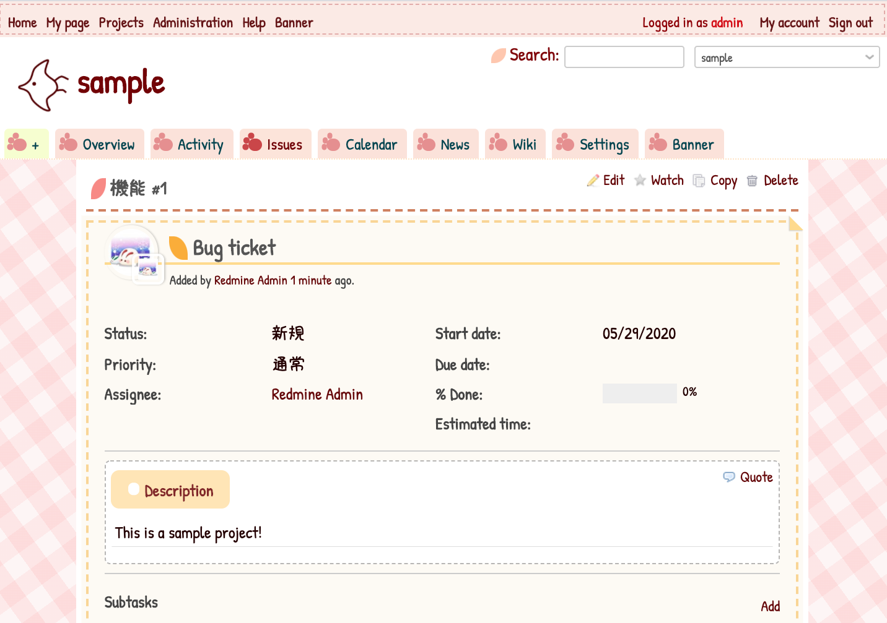

# Redmine theme for kids / Kodomo Redmine

Redmine theme for kids and children.

I created this theme inspired by [JIRA Jr.](https://www.atlassian.com/jirajr) and [various WordPress themes for kids and children](https://www.theme-junkie.com/best-wordpress-themes-for-kids-and-children/).

This theme is still experimental, but I hope to provide a more friendly Redmine with bright colors and fun fonts.

If you are interested, try creating a theme for kids and different generations!

<!-- TOC depthFrom:2 orderedList:false -->

- [Screen shot](#screen-shot)
- [Sample Movie](#sample-movie)
- [Installation](#installation)
- [docker-compose](#docker-compose)
- [for Japanese Users](#for-japanese-users)
  - [利用しているフォントについて](#利用しているフォントについて)
    - [きろ字のご利用について](#きろ字のご利用について)
      - [きろ字情報](#きろ字情報)
    - [あんずもじのご利用について](#あんずもじのご利用について)
      - [配布サイト](#配布サイト)
      - [配置手順](#配置手順)
  - [配置方法](#配置方法)
    - [テーマのみの配置](#テーマのみの配置)
    - [メッセージのカスタマイズ](#メッセージのカスタマイズ)
  - [おためし用Dockerfile](#おためし用dockerfile)
    - [ローカルで直にビルドして起動する場合](#ローカルで直にビルドして起動する場合)
    - [テーマを編集開発しながら起動する場合](#テーマを編集開発しながら起動する場合)
- [テーマのカスタマイズ](#テーマのカスタマイズ)
- [Special Thanks](#special-thanks)
- [ChangeLog](#changelog)

<!-- /TOC -->

## Screen shot



## Sample Movie


## Installation

- Download zip file from release page
- Extract zip file, and move to public/themes/redmine_theme_kodomo at Redmine directory
- Open Redmine page, and go to Administration > Settings > Display
- Enable the redmine_theme_kodomo from Theme, and save settings

## docker-compose

You can try this theme via Docker.

- ``docker-compose up -d``
- Access to http://localhost:3000/ on web browser
- Sign in to Redmine as an administrator
- Select the theme from the administration screen.
- Stop is docker-compose stop.

---

## for Japanese Users


### 利用しているフォントについて

こちらのテーマでは、以下のフォントの利用を想定しています。
日本語に関しては、「きろ字 / Kosugi Maru / あんずもじ」の利用を想定してのデザインになっております。
お手数をおかけしますが、各自お手元でのフォントのダウンロードをお願いいたします。

**英語**

- Google fonts - [Patrick Hand](https://fonts.google.com/specimen/Patrick+Hand)
 - Designer: Patrick Wagesreiter
 - License: [Open Font License](https://scripts.sil.org/cms/scripts/page.php?site_id=nrsi&id=OFL)
 - https://fonts.google.com/specimen/Patrick+Hand

**日本語**

- きろ字
  - New BSDライセンスに基づくきろ字をメインのフォントとして利用させていただきます
  - https://ola.kironono.com/entry/fonts-kiloji
  - フォントが組み込まれない場合は、デフォルトの日本語フォントが利用されます
- Google fonts - [Kosugi Maru](https://fonts.google.com/specimen/Kosugi+Maru) (as 'Kosugi Maru')
  - Designer: MOTOYA
  - License: [Open Font License](https://scripts.sil.org/cms/scripts/page.php?site_id=nrsi&id=OFL)
  - https://fonts.google.com/specimen/Kosugi+Maru
- あんずもじ
  - あんずもじに関しては、各自でのダウンロードと配置をお願いします
  - フォントが組み込まれない場合は、デフォルトの日本語フォントが利用されます

#### きろ字のご利用について

New BSDライセンスで利用可能な「きろ字」をメインのフォントとして利用させていただききました。
ttfからwoffへ変換して利用としております。

##### きろ字情報

- 手書き風総合書体「きろ字」
 - 詳細情報: <https://ola.kironono.com/entry/fonts-kiloji>
 - 作成者: kilo さま

```
% tree font
font
└── kiloji
    ├── License.txt
    ├── kiloji.ttf
    ├── kiloji.woff
    ├── kiloji_b.ttf
    └── kiloji_b.woff

1 directory, 5 files
```

標準フォント、Google fontでのご利用に切り替えたい場合は、以下の方法でfonts.cssを調節してください。

#### あんずもじのご利用について

大変可愛らしい文字ですので、もしお手元でご利用の際に組み込み可能でしたら、是非ご利用してみてください！
あんずもじを利用するに当たって、以下の通りにお願いいたします。

##### 配布サイト

- あんずいろapricot×color
 - 配布サイトURL: <http://www8.plala.or.jp/p_dolce/index.html>
 - 作成者: 京風子（Kyoko）さま

##### 配置手順

- 配布サイトURL: <http://www8.plala.or.jp/p_dolce/index.html> からフォントのダウンロードをお願いします
  - あんずもじ
  - あんずもじ等幅
- font というディレクトリに、以下のように配置をお願いします

```bash

$ tree font
font
├── APJapanesefont.ttf
└── APJapanesefontT.ttf

```

- フォントはfonts.css に記載と同じとなります
- fonts.css の設定で、'Patrick Hand' の後に 'anzu' を指定して下さい
  - 例: ``font-family: 'Patrick Hand', 'anzu', 'kiroji_b', 'Kosugi Maru'``
- 配置の上でRedmineの再起動をお願いいたします

### 配置方法

#### テーマのみの配置

- Redmineのディレクトリ/public/themes/ 以下に展開します
- 配置後にRedmineを再起動します

参考: Redmineのディレクトリ/public/themes/ 以下

```bash
$ tree -L 1
.
├── README
├── alternate
├── classic
└── redmine_theme_kodomo

3 directories, 1 file
```

#### メッセージのカスタマイズ

このテーマ単体では、現在こども用のメニュー、ラベルには対応していません。

子ども向けにメッセージをカスタマイズする場合は、``redmine_message_customize`` プラグインなどを使うことを想定しています。

- <https://github.com/ishikawa999/redmine_message_customize.git>

### おためし用Dockerfile

このリポジトリの直下にDockerfileがありますので、簡単な確認が可能です。

#### ローカルで直にビルドして起動する場合

```bash
# build image
docker build -t redmine_theme_kodomo_container:latest .

# run container
docker run --rm -d -p 3000:3000/tcp redmine_theme_kodomo_container:latest
```

コンテナを起動後、アカウント:admin / パスワード: admin でログインできます。

#### テーマを編集開発しながら起動する場合

```bash
git clone https://github.com/akiko-pusu/redmine_theme_kodomo
cd redmine_theme_kodomo
docker-compose build --no-cache
docker-compose up -d
```

上記で、テーマが適用された状態でRedmineが起動します。
http://localhost:3000/ にアクセスしてください。

また、該当のディレクトリで、直にCSS, JavaScriptを編集しつつ、動作確認ができます。


## テーマのカスタマイズ

粗いCSSですが、ソースを見ていただくとどのあたりを修正しているかがわかるかと思います。
また、theme.js を修正することで、プラグイン形式にしなくても、簡単なコンテンツの差込なども可能です。
画像やフォント、メッセージを調整してみてください！

## Special Thanks

- Redmine.org - <https://redmine.org/>
- Japanese Redmine Community - <http://redmine.jp/community/>
- Font developers

## ChangeLog

- 0.0.4
  - Update Dockerfile. (To use Redmine 4.1-stable.)
  - Apply flash message (success / error) style.
  - Enabled to show theme information at the footer.
  - Update some styles.
- 0.0.3
  - Change loading style when login / logout.
  - Add CSS file for Redmine Banner.
  - Use kiloji as Japanese font.
  - Update style for administration.
  - Change base style. (The same to ``redmine_theme_kodomo_midori``)
- 0.0.2
  - Add great-job.png /Change border style of sidemenu (In responsive mode)
- First Release: 0.0.1
